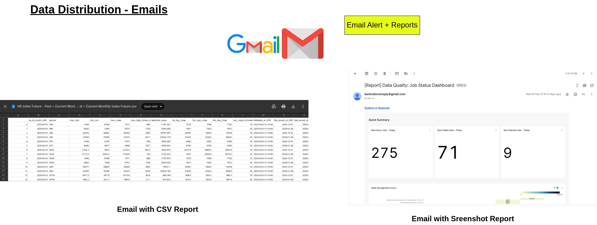

.. note::

   View my analytics work here!

   https://kenho811.github.io/home_data_centre_public_mirror/

My Journey of building a Home Data Centre
=================================================

This project originated from my passion for automating the manual processes my father performs for his investment activities. He used to gather data from various online sources and paste it into an Excel file for analysis. I found this method tedious and error-prone, so I sought ways to automate it by teaching myself Python.

It began as a simple project where I scraped one online data source and directly imported it into Excel for my father's use. However, the scope expanded, requiring more data sources. Additionally, raw data became insufficient for deriving insights, necessitating data transformation. Performing all these ETL steps in a single Python program became increasingly unmanageable.

Since starting my first job as a Python/Data Engineer in 2021, I have learned the fundamentals of data engineering. I applied the knowledge acquired at work to my home setup, leading to the architecture currently in use. This setup has already undergone several revisions.

Initially, in 2021, I used several old Lenovo laptops (two with 4 GB RAM and 500 GB HDD, and one with 8 GB RAM and 1 TB HDD) to create a cluster of computers connected via the home router. However, as the data volume grew, I purchased a desktop with 64 GB RAM in March 2024. On this new desktop, I installed Proxmox, a hypervisor capable of running virtual machines. As of March 2025, I am running several VMs on Proxmox, each hosting a service accessible via a URL that can only be resolved using a DNS server with custom AAAA records in the home network.

This project not only provides tangible value for my father's investment activities, but it also deepens my understanding of data engineering. I plan to use the data to further explore machine learning and artificial intelligence.

Hardware
---------------------------

As of March 2025, my server has 128GB RAM, i5 intel Gen 14th Core, 1 x 8TB HDD + 1 x 4TB HDD, 1 x 1TB SSD + 1 x 4TB SSD.

Architecture
---------------------------

Software Architecture
~~~~~~~~~~~~~~~~~~~~~~~~~~~~

First and foremost, the investment activities supported by the data span several days, meaning real-time data is not necessary. This justifies the use of a batch ingestion framework like Apache Airflow.

I also anticipate that data volume will increase over time, so I opted for MinIO, an S3-compatible object storage solution. Currently, I use Apache Iceberg as the file format for storing this data. Iceberg is best supported by Dremio, an open-source data lakehouse that functions solely as a compute engine without storing data. In practice, Dremio connects directly to data sources (e.g., MinIO) to fetch data, returning it to the client without maintaining a copy.

For storing metadata related to ingestion (e.g. Airflow's DAG runs and ingestion logs), I use PostgreSQL. Row-by-row insertion is optimal for RDBMS like PostgreSQL, while bulk insertion is better suited for big data file formats like Apache Iceberg. I learned this after facing challenges with the increasing file size of Iceberg due to row-by-row insertion.

The data consumers include Apache Superset and a bespoke data client GUI I created with PySide. Apache Superset is a versatile business intelligence tool that allows me to visualize price movements with line charts, create data quality dashboards for freshness and row count inspections, and send reports at regular intervals to Gmail accounts. While powerful, it does not fully replace all data applications. My father has specific requirements for the format of an Excel file used in his investment activities. Therefore, I developed a PySide GUI that allows him to input parameters such as dates and stock codes, connects to Dremio, and exports the results to Excel.

Platform Architecture
~~~~~~~~~~~~~~~~~~~~~~~~~~~~

To support all the applications mentioned, an easily maintainable platform is essential. I use Proxmox, a hypervisor capable of running Virtual Machines and LXD containers (think of these as lightweight VMs). Built on the Debian Linux distribution, Proxmox features a remotely accessible GUI, allowing for easy creation of Virtual Machines, CPU and RAM allocation, and installation of any operating system via .iso files downloaded online.

When deploying applications on Proxmox Virtual Machines, I separate stateful and stateless applications:

- **Stateful applications** like Postgres and Minio each run in their own Virtual Machines, facilitating easy rollback and data backup.
- **Stateless applications** run on Kubernetes, which is hosted on a single Virtual Machine. This setup allows for straightforward deployment via Helm charts, which are widely available online.
- **Infrastructure-critical applications** (e.g., DNS and DHCP servers, Docker container registry/package artifactory) operate in separate LXD containers. This configuration ensures basic functionalities remain intact even if Kubernetes experiences failures, such as resource contention.
For networking, I use Technitium. While it offers many features, I primarily utilize it as a DHCP server (assigning IP addresses to Virtual Machines and LXD containers) and a DNS server (resolving human-readable URLs to IP addresses). This setup allows me to access my Minio buckets via a URL like http://minio-prod instead of a numeric IP address.

For my Docker container registry and package artifactory, I use Gitea, which is similar to GitHub. Previously, I relied on the public Docker Hub for my container registry, but I wanted to maintain privacy for my program logic, and Gitea provides that solution. Additionally, Gitea serves as a Python package artifactory, storing a core Python library that several other Python programs depend on. This core library contains reusable transport classes, such as connections to Dremio and Postgres, and data ingestion routines.

ETL
--------------

Data Ingestion
~~~~~~~~~~~~~~~~~~~~~~~~~~~~

For data analytics, I ingest various data sources and store them in the data lakehouse according to the Medallion Architecture. This architecture organizes data into three layers: (i) raw form, (ii) cleaned and enriched form, and (iii) directly consumable form for end users.

To scrape data online, I use Scrapy, a robust Python framework that offers a variety of built-in tools for web scraping, such as auto-throttling, item pipelines, and CSV exports. All these ingestion processes are managed by Apache Airflow, which serves as an advanced cron scheduler with a user-friendly interface.

Data Transformation
~~~~~~~~~~~~~~~~~~~~~~~~~~~~

Ingesting raw data is usually just the first step. My father needs summary data, such as the highest and lowest prices of the month or the rolling directed volume of a stock over the past 30 days.

To achieve that, I use the following tools:

- **dbt (Data Build Tool)**: dbt is a Python framework that leverages Jinja templating to assist with data transformation in a database. Users can create transformation logic using SQL, which is both easy to understand and executes directly within the database. The benefit is manifold: the data never leaves the database during transformation, and dbt performs operations like `CREATE TABLE AS (SELECT <transformation_logic>)` efficiently.

- **Pure Python**: While SQL is powerful, it is not ideal for row-by-row transformations. Additionally, SQL abstracts execution behavior, limiting granular control. With Python, I can calculate rolling volume in a more memory-efficient manner and in smaller batches. Although SQL can achieve this using window functions, managing memory usage is more challenging.

Data Distribution
~~~~~~~~~~~~~~~~~~~~~~~~~~~~

   :alt: Data Dashboards

For viewing trends and high-level summaries, Apache Superset is an indispensable business intelligence tool. Using Apache Superset, I have built several trend indicators, including the shareholding of HKEX CCASS participants for each stock, price and volume movements, data quality dashboards for data ingestion and transformation, and stock pickers with various metrics (e.g., P/E ratios, liquidity ratios, etc.).

   :alt: Emails with reports

Apache Superset also features a user-friendly scheduler that can send out reports at regular intervals and trigger alerts for specific events. I've configured it to send these reports via Gmail.

My father has specific requirements for the data format he needs. To meet these requirements, I created a GUI using the PySide framework. This application extracts data from the data lakehouse and exports it as an Excel file.

Next Steps
------------

With the large amount of data collected, I aim to explore machine learning and artificial intelligence to assist in making investment decisions.

